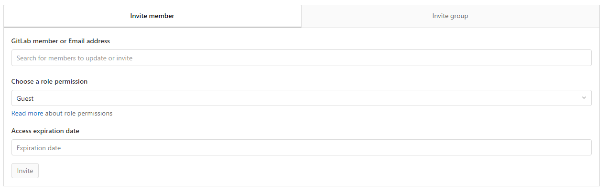

# GitHub Organizations & GitLab Groups Tutorial

This is a very brief and quick tutorial on how to set up and navigate organizations and groups in GitHub and GitLab respectively. The information from this tutorial are obtained and summarized from  
* GitHub Organizations documentation: [https://docs.github.com/en/organizations](https://docs.github.com/en/organizations)
* GitLab Groups documentation: [https://docs.gitlab.com/ee/user/group/](https://docs.gitlab.com/ee/user/group/)

# Table of Contents
1. [GitHub Organizations](#github)  
    * [Creating a New Organization From Scratch](#github-neworg)
    * [Creating SubOrganizations (Teams) within an Organization](#github-suborg)
    * [Navigate to an Existing Organization](#github-existingorg)
    * [Deleting/Renaming an Organization](#github-deleterename)
    * [Inviting and Managing Members](#github-members)
    * [Add Pre-existing Repositories to Organization](#github-addrepo)
2. [GitLab Groups](#gitlab)
    * [Creating a New Organization From Scratch](#gitlab-newgroup)
    * [Creating SubGroups within a Group](#gitlab-subgroup)
    * [Navigate to an Existing Organization](#gitlab-existinggroup)
    * [Deleting/Renaming an Organization](#gitlab-deleterename)
    * [Inviting and Managing Members](#gitlab-members)
    * [Add Pre-existing Repositories to Organization](#gitlab-addrepo)

# GitHub Organizations 
## Creating a New Organization From Scratch 
1. Navigate to the **Select Plan** page.  
**Method 1:**  
a. Click on your profile photo on the top-right corner of any of your Github page, then select **Settings**.
  
b. In the user settings sidebar on the left, click on **Organizations**.  
c. Click on **New organization**.  
  
**Method 2:**  
a. Click on the **+** drop-down menu on the top-right corner of any of your Github page, then select **New organization**.

4. This will then prompt you to select a plan for your team or organization. The current plan is summarized as follows:  
 <table>
<tr>
    <th></th>
    <th>Free</th>
    <th>Team</th>
    <th>Enterprise</th>
</tr>
<tr>
    <td><b>Price</b></td>
    <td><li>$0</li></td>
    <td><li>$4 per user/month</li></td>
    <td><li>$21 per user/month</li></td>
</tr>
<tr>
    <td><b>Benefits</b></td>
    <td>
        <li>Unlimited public/private repositories</li>
        <li>Unlimited collaborators</li>
        <li>2,000 Actions minutes/month (Free for public repositories)</li>
        <li>500MB GitHub Packages</li>
        <li>Community Support</li>
    </td>
    <td>
        <li>Unlimited public/private repositories</li>
        <li>Unlimited collaborators</li>
        <li>3,000 Actions minutes/month (Free for public repositories)</li>
        <li>2GB GitHub Packages</li>
        <li>Community Support</li>
        <li>Required reviewers</li>
        <li>Code owners</li>
    </td>
    <td>
        <li>Unlimited public/private repositories</li>
        <li>Unlimited collaborators</li>
        <li>50,000 Actions minutes/month (Free for public repositories)</li>
        <li>50GB GitHub Packages</li>
        <li>Community Support</li>
        <li>Required reviewers</li>
        <li>Code owners</li>
        <li>SAML single sign-on</li>
        <li>Advanced auditing</li>
    </td>
</tr>
</table>

Depending on the size of the organization and projects, the **Free** and **Team** plans should suffice.

5. Set up the organization by filling up the following:

6. Invite members to the organization to complete the set up process.

7. Once you're done, you should see a page that looks like the following. This is the main page of your organization.

## Creating SubOrganizations (Teams) within an Organization 
1. In GitHub, sub-organizations are known as teams. Once an organization has been set up, it is very straightforward to create teams from within. From the organization main page, click on **Teams**.
2. Under the **Teams** tab, select **New team**. Fill up the following and hit **Create team**.

3. A new team is now created. To manage repository access and permission for each team, click [here](https://docs.github.com/en/organizations/managing-access-to-your-organizations-repositories/managing-team-access-to-an-organization-repository).

**Note:** Nested teams can be created as shown in the image in step 2. Child teams inherit the parent's access permissions, simplifying permissions management for large groups. Members of child teams also receive notifications when the parent team is @mentioned, simplifying communication with multiple groups of people. For more information, click [here](https://docs.github.com/en/organizations/organizing-members-into-teams/about-teams).

## Navigating to an Existing Organization 
1. Click on your profile photo on the top-right corner of any of your Github page, then select **Your profile**.  
  
2. On the left side of your profile page, click on the icon of your organization under **Organizations**.

## Deleting/Renaming an Organization 
1. Navigate to your organization page, click **Settings**.  

2. Scroll all the way down to **Danger zone** and click on **Delete this organization** or **Rename organization** depending on your needs.  

## Inviting and Managing Members 
1. Navigate to your organization page, click **People**.  

2. New members can be invited by clicking on **Invite member**, while current members can be managed from the settings button in the member list.  

For more information on managing members in a GitHub organization, please visit [this link](https://docs.github.com/en/enterprise-server@3.0/organizations/managing-membership-in-your-organization/adding-people-to-your-organization).

## Add Pre-existing Repositories to Organization 
Assuming that we have some pre-existing repositories on individual accounts that we want to add to the organization, we can do the following:  
1. Navigate to the repository and click on **Settings**.

2. Scroll all the way down to the **Danger zone** and click on **Transfer ownership**.  

# GitLab Groups 
## Creating a New Group from Scratch 
1. After logging into GitLab, you can access the **Groups** drop-down menu on the top left of your screen.
  
2. You can either navigate to **Your groups** then click on **New group**, or you can click on **Create group** to directly reach the following page:  

Fill up this page and click **Create group** and you're good to go.

## Creating SubGroups within a Group 
The following is stated on the GitLab documentation on subgroups.
> By using subgroups you can do the following:  
> * **Separate internal / external organizations**. Since every group can have its own visibility level (public, internal, or private), you’re able to host groups for different purposes under the same umbrella.
> * **Organize large projects**. For large projects, subgroups makes it potentially easier to separate permissions on parts of the source code.
> * **Make it easier to manage people and control visibility**. Give people different permissions depending on their group membership.

1. To create a subgroup you must either be an Owner or a Maintainer of the group, depending on the group’s setting. The setting can be changed for any group by:
    * A group owner. Select the group, and navigate to **Settings** > **General** > **Permissions, LFS, 2FA**.
    * An administrator. Navigate to **Admin Area** > **Overview** > **Groups**, select the group, and choose **Edit**.
2. In the group’s dashboard click the **New subgroup** button.

3. Create a new group like you would normally do. Notice that the immediate parent group namespace is fixed under **Group path**. The visibility level can differ from the immediate parent group.

4. Click the **Create group** button to be redirected to the new group’s dashboard page.

**Note:** When you add a member to a group, that member is also added to all subgroups. Permission level is inherited from the group’s parent. This model allows access to subgroups if you have membership in one of its parents.

## Navigating to an Existing Group 
Navigating to an existing Group by clicking on **Your groups** from the **Groups** drop-down menu on the top left of your screen.  

## Deleting/Renaming a Group 
1. Navigate to an existing group. On the menu on the left side of your screen, click **Settings**  &#8594; **General**.  

2. Your group can be renamed under **Naming, visibility** section as shown.  
  
To delete a Group, scroll all the way down and expand the **Advanced** section, then scroll all the way down once again until you see the **Remove group** section.  

## Inviting and Managing Members 
1. From the left menu, select **Members**.
2. You can invite collaborators/groups into your pre-existing group by filling up the necessary details at the top of the page.  

3. To delete members, scroll down until you see the **Members** list. Next to the member you want to remove, select **Delete** &#8594; **Remove member**.  
For more info on removing group members, follow [this link](https://docs.gitlab.com/ee/user/group/#remove-a-member-from-the-group).

## Add Pre-existing Repositories to Organization 
Assuming that we have some pre-existing repositories on individual accounts that we want to add to the group, we can do the following:  
1. Navigate to the repository and click on **Settings** &#8594; **General**. 
2. Scroll all the way down and expand the **Advanced** section, then scroll all the way down once again until you see the **Remove group** section. 

3. Select the group you want to transfer to under **Select a new namespace**.